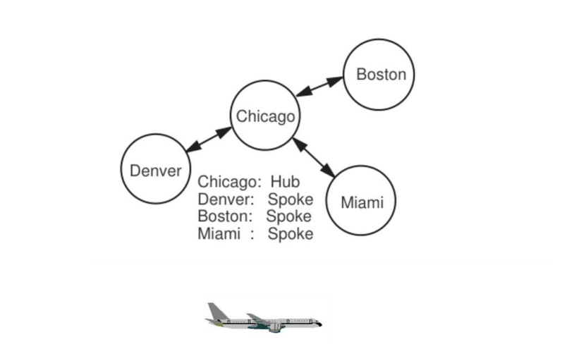

# Airline Revenue Management Optimization

An interactive application using Operations Research techniques to optimize airline seat allocation and maximize revenue.



## Overview

This application demonstrates advanced airline revenue management techniques, combining Displacement Adjusted Virtual Nesting (DAVN) and Expected Marginal Seat Revenue (EMSR-b) algorithms to solve the complex problem of seat inventory control across a flight network.

The goal is to determine optimal booking limits for each fare class on each flight leg, maximizing overall revenue while accounting for network effects, demand uncertainty, and potential cancellations.

## Features

- **Interactive Data Analysis**: Visualize the results through interactive tables and charts
- **Editable Input Parameters**: Modify fares, demand forecasts, capacities, and network structure
- **Network Optimization**: Uses Linear Programming to determine optimal allocation across a network
- **Booking Limit Calculations**: Implements the EMSR-b algorithm for setting booking limits per fare class
- **Displacement Adjusted Virtual Nesting**: Accounts for network effects in pricing decisions

## Algorithms & Methods

### DAVN (Displacement Adjusted Virtual Nesting)

This method adjusts the perceived value of each product (ticket type) by accounting for network displacement costs. When a passenger books a seat on one leg, they may be displacing potential revenue from passengers who want to book a longer, more profitable itinerary that includes that leg.

DAVN uses shadow prices from a linear programming solution to calculate adjusted "virtual fares" that represent the true value of each product to the network.

### EMSR-b (Expected Marginal Seat Revenue)

This algorithm helps determine how many seats to protect for higher-fare classes versus allowing bookings for lower-fare classes. It uses:

- Expected demand for each fare class
- The fare values
- Statistical probability distributions (Poisson)

to calculate protection levels and booking limits that maximize expected revenue.

## How to Use

1. Install dependencies:
   ```
   pip install -r requirements.txt
   ```

2. Run the application:
   ```
   streamlit run app.py
   ```

3. In the application:
   - View the description and explanation of airline revenue management
   - Click "Show/Hide Input Data" to review the default input parameters
   - Optionally edit the input parameters by modifying the displayed tables
   - Click "Run Optimization" to calculate optimal booking limits
   - Click "Show Visualizations" to view graphical representations of the results

## Input Data

- **Product Fares**: The price for each product (ticketing option)
- **Expected Demand**: Forecasted demand for each product
- **Leg Capacity**: The seat capacity for each flight leg
- **Cancellation Probability**: The likelihood of cancellations for each leg
- **Product-to-Legs Mapping**: Which flight legs are used by each product

## Mathematical Foundation

The system uses a two-step approach:
1. **Network Optimization**: A linear program maximizes revenue across the entire network
   ```
   maximize ∑(fare_j × allocation_j)
   subject to:
   - allocation_j ≤ demand_j for all products j
   - ∑(allocation_j) ≤ capacity_l for each leg l
   ```

2. **Booking Control**: EMSR-b algorithm uses virtual fares to set nested booking limits

## Requirements

- Python 3.7+
- Streamlit
- NumPy
- Pandas
- PuLP
- SciPy
- Matplotlib
- Seaborn

## Project Structure

- `app.py` - Main Streamlit application
- `requirements.txt` - Python dependencies
- `figure.png` - Hub-and-spoke network diagram
- `test1.py` - Standalone test script for the optimization algorithms

## References

This implementation is based on revenue management concepts from:
- The theory of Expected Marginal Seat Revenue
- Network displacement cost calculation
- Airline pricing and revenue management literature

## License

This project is intended for educational purposes.
